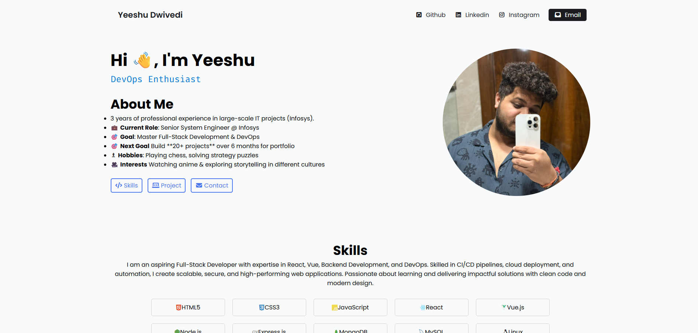

# 🖥️ Portfolio Website – Reskilling Journey Project

This portfolio website is part of my **6-month reskilling journey** where I’m building real-world projects to strengthen my **Full Stack + DevOps skills**.  
It showcases my work, skills, and projects as I progress through the roadmap.

---

## 🖼️ Preview

---

## 📌 About This Project

* ✅ Built as the **first project** in my reskilling roadmap
* 🖼️ Focused on **personal branding & professional project showcase**
* 📱 Fully responsive design for desktop, tablet, and mobile
* 🚀 Will act as the **central hub** to link all my upcoming projects

---

## 🛣️ Next Steps in My 6-Month Roadmap

This project is the **first step** of my reskilling journey. Here’s what comes next:

1. 🟢 **Landing Page** – HTML, CSS
2. 🟡 **Portfolio Website (Current)** – Personal branding + multiple project showcases
3. 🔵 **Interactive Dashboard** – Vue/React + charts + real data
4. 🟣 **Full-Stack Web App** – React/Vue frontend + Node/Express backend + database
5. 🟠 **DevOps Integration** – Docker, CI/CD, Terraform, AWS deployment
6. 🔴 **Capstone Project** – End-to-end deployed application with full stack + DevOps

---

✨ Stay tuned as I keep updating this repo with my progress!

