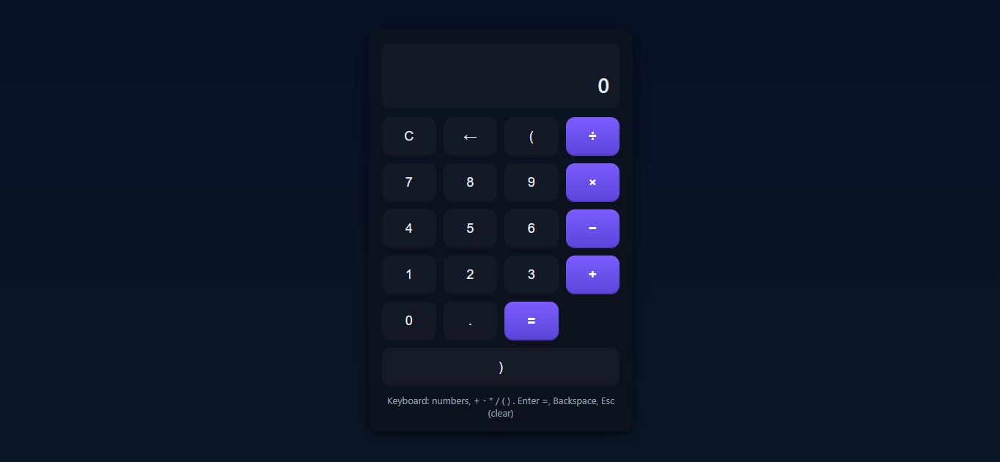

# 🧮 Modern Calculator

A sleek and fully functional **Calculator App** built with **HTML, CSS, and Vanilla JavaScript**.  
Part of my **6-month reskilling journey** to master frontend development and practical JavaScript projects.

---

## 🖼️ Preview  

---

## 📌 About  
- ⚡ Performs all basic arithmetic operations (+, −, ×, ÷)  
- ⌨️ Supports both **keyboard and button inputs**  
- 🧠 Handles brackets, decimals, and expression evaluation  
- 🎨 Clean **dark UI** with glowing button effects  
- 💡 Built using **pure JavaScript (no frameworks)**  

---

## 🧠 Tech Stack  
- **HTML5** – Structure  
- **CSS3** – Styling & Layout  
- **JavaScript (ES6)** – Core logic & functionality  
